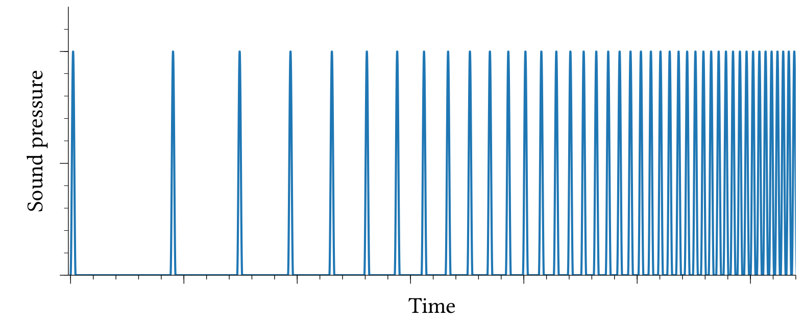
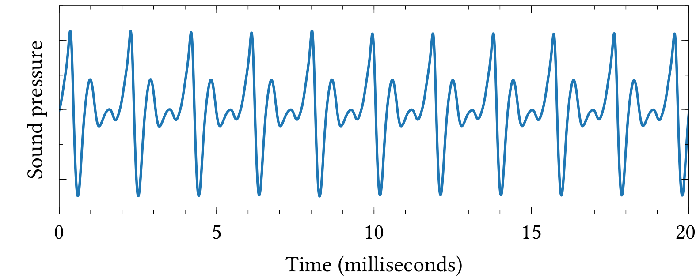
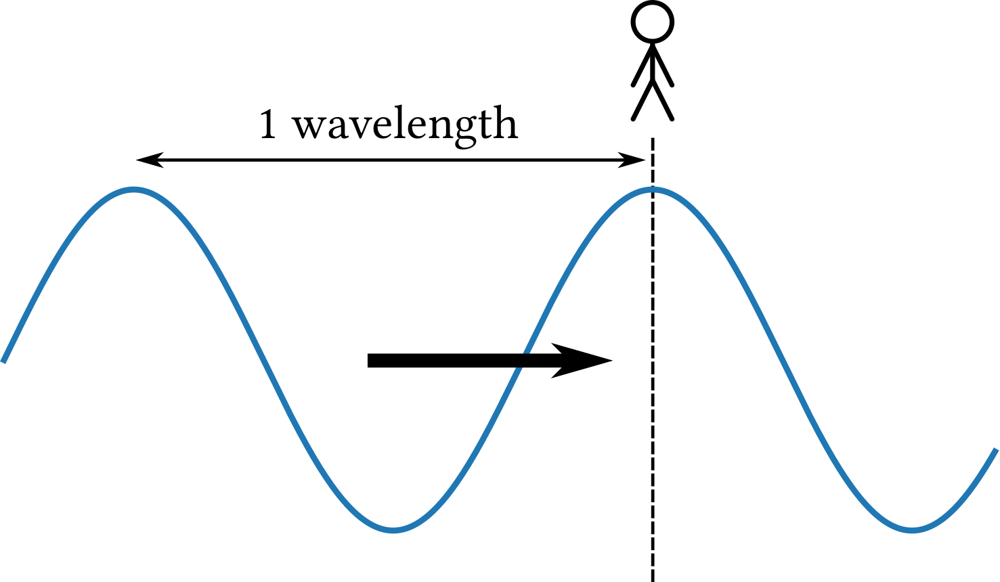
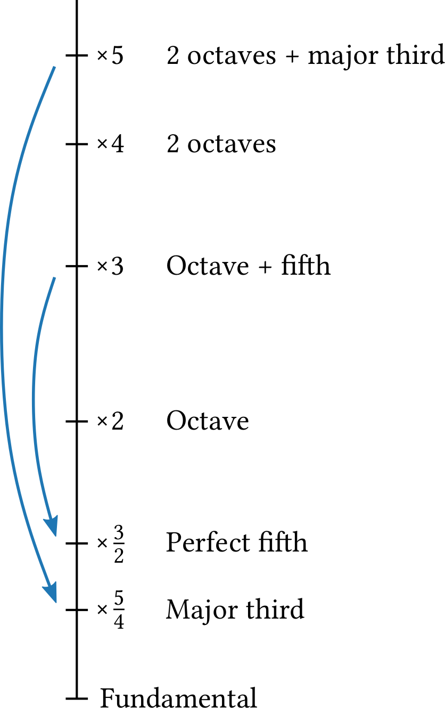
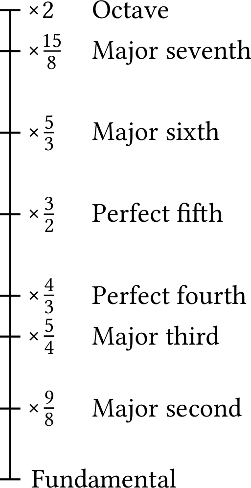
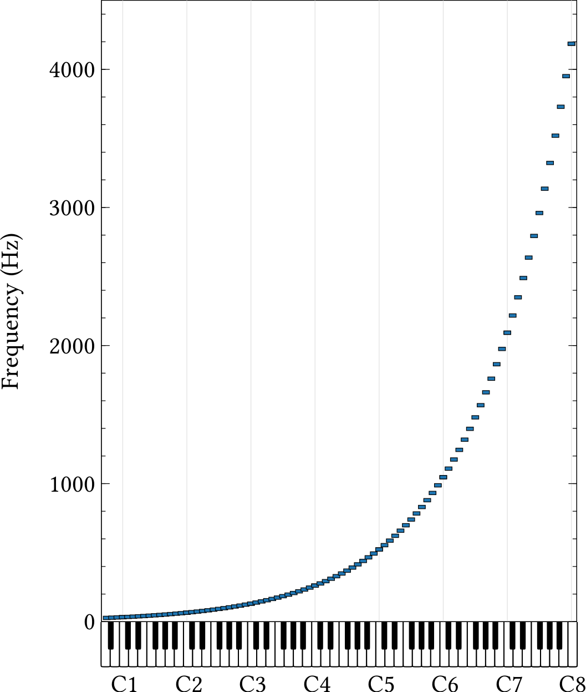
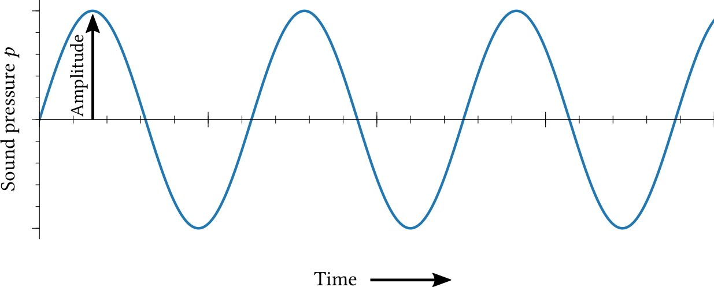
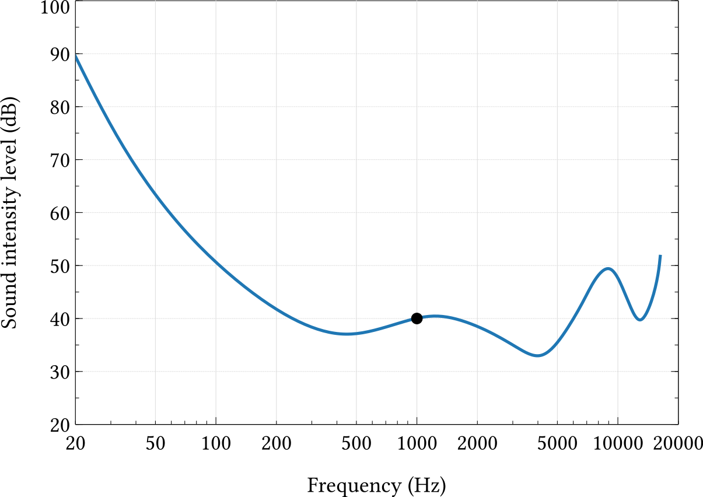
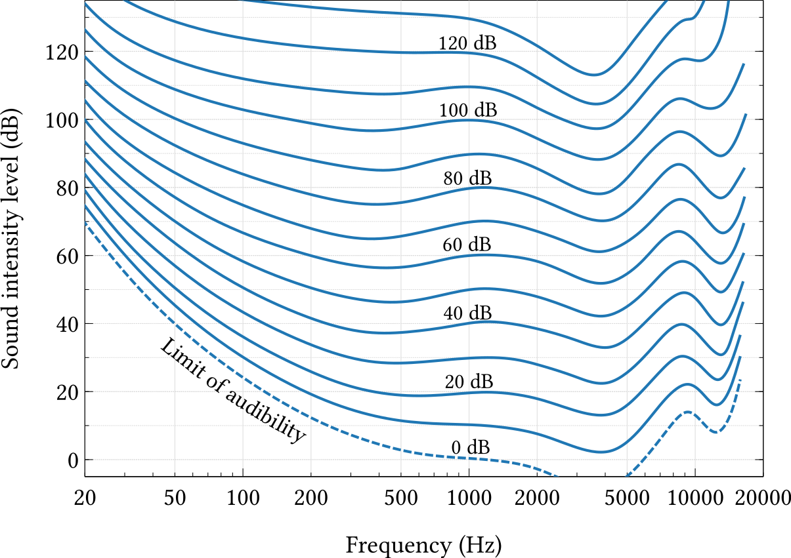
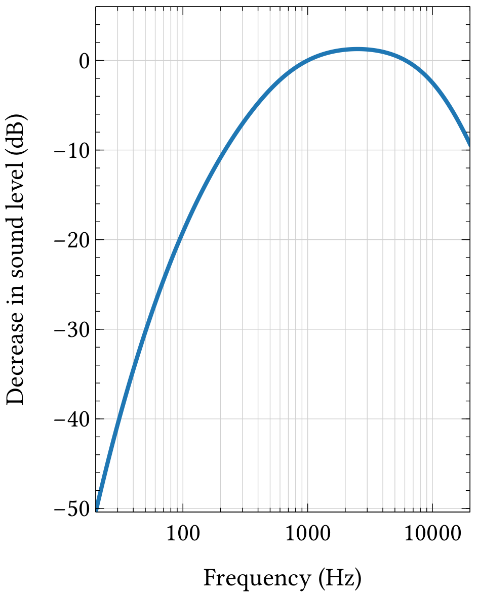

# Audio 

::: {.callout-note}
# Goal
Understand what an audio signal is and how it is represented digitally .
:::

::: {.callout-note}
The figures in this chapter come from the fantastic book _The Science of Music_ 
by Mark @Newman2023: [https://websites.umich.edu/~mejn/tsom/](https://websites.umich.edu/~mejn/tsom/).
:::

Clearly, music is related to sound, and artistic commentaries such as 
John Cage's _4'33_ are exceptions that confirm the rule. 
Thus, in order to understand music and how to encode it, 
we need a basic understanding of how sound works. 

## Periodic waveforms and frequency

However, frequencies need not be static, but can change over time. 
The figure shows a signal with increasing frequency. 
We hear it first as a series of clicks that gradually morph into sound which, in turn,
rises in pitch. For any given time interval, we could count the number of peaks 
and know the frequency at that point in time.

{width=80%}

<audio controls src="./sound/clicks.mp3"></audio>

This is an example of a simple signal. Usually, periodic signals are more complex, 
such as the one shown in the figure below. It represents the _waveform_ of 
a single note played on a trumpet. While this signal is much more 'wiggly', 
we can still easily see its periodicity.

{width=80%}

Periodic signlas like this are most impartant to us because 
they correspond to continues tones with a fixed pitch.
A crucial feature of a periodic waveform is its _frequency_, 
and we measure frequency as a rate within a given time interval. 
For instance, the signal in the figure above has 10 cycles within a 
span of 0.02 seconds (or 20 milliseconds), 
thus its frequency $f$ is 500 cycles per second, or 500 Hz.

$$
f = \frac{10\;\text{cycles}}{0.02\;\text{seconds}} = 500\;\text{cycles per second}
$$
We can move around the parts of this equation and also talk about this 
waveform's _period_, the time it takes for one complete cycle:
$$
T = \frac{1}{f},
$$
in our case: 
$$T = 1/f = 1/500 \text{seconds} = 0.002 \text{seconds},$$
and 10 periods would last 
$$10 \times 0.002 \text{seconds} = 0.02 \text{seconds} = 20 \text{milliseconds}.$$

### Wavelength

Frequency is not the only way to describe a complex periodic waveform.
While frequency describes the periodicity of a signal in time, 
_wavelength_ describes it in spatial terms. The figure below shows 
a person at a certain point in space, and the signal travels past them.
The wavelength $\lambda$ is the distance in space crossed by one cycle of 
the wave.

{width=60%}

Wavelenght and frequency are directly related to one another:
$$
\lambda = cT = \frac{c}{f},
$$
where $c \approx 343 m/s$ is (approximately) the speed of sound.

So, how far does our signal travel?

This kind of information is not only of theoretical interest,
but has wide ramifications for acoustics and the architecture of 
concert halls as well as design of recording studios and technology.

### Pitch 

- amplidute $A$
- frequency $f$ 
- limits of hearing,  Audible range and volume
- intervals: octave and fifth 
- phase $\phi$

$$x(t) = A \sin(2\pi ft + \phi)$$

## Intervals and scales

Adding pure tones and decomposition via Fourier (link to 3b1b)

- Timbre 
- Waveform to spectrogram 
- reading melodies from a spectrogram

### Frequency and intervals 

### The major scale

{width=40%}
{width=30%}

### Equal temperament and the twelve-tone scale

{width=50%}

## Amplitude and loudness 

## Digital audio

- Sampling 

::: {.callout-note}
# Further reading

Excellent introductions can be found in @Sethares2005, @Mueller2015, and @Eerola2025.
:::
